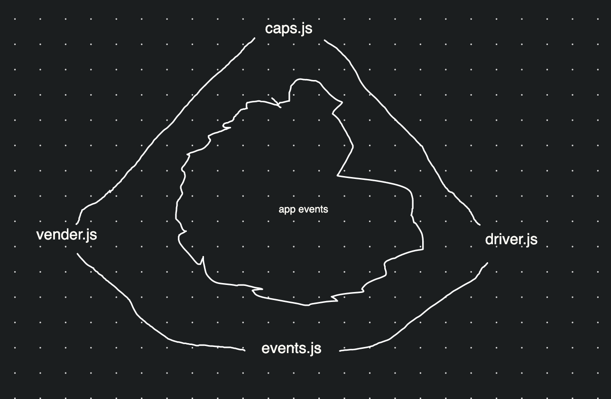

# LAB - Class 11

## Project: CAPS

### Author: kale lesko

### Links and Resources

- [ci/cd](https://github.com/Saynka/CAPS/actions)
<!-- - [back-end server url](http://xyz.com) (when applicable)
- [front-end application](http://xyz.com) (when applicable) -->

### Setup

.
├── LICENSE
├── README.md
├── **tests**
│ ├── driver.test.js
│ └── vendor.test.js
├── assets
│ └── whiteboard.png
├── caps.js
├── coverage
│ ├── clover.xml
│ ├── coverage-final.json
│ ├── lcov-report
│ │ ├── base.css
│ │ ├── block-navigation.js
│ │ ├── driver.js.html
│ │ ├── events.js.html
│ │ ├── favicon.png
│ │ ├── index.html
│ │ ├── prettify.css
│ │ ├── prettify.js
│ │ ├── sort-arrow-sprite.png
│ │ ├── sorter.js
│ │ └── vendor.js.html
│ └── lcov.info
├── package-lock.json
├── package.json
├── refrences
│ └── demo
│ ├── class
│ │ └── things.js
│ ├── modular
│ │ ├── body-parts
│ │ │ ├── arms
│ │ │ │ ├── arms-handlers.js
│ │ │ │ └── arms.js
│ │ │ └── eyes
│ │ │ └── eyes.js
│ │ ├── brain.js
│ │ └── event-pool.js
│ └── monolithic
│ └── body.js
└── src
├── driver.js
├── events.js
└── vendor.js

#### `.env` requirements

- `N/A`

<!-- - `PORT` - Port Number
- `MONGODB_URI` - URL to the running mongo instance/db -->

#### How to initialize/run your application (where applicable)

- `npm init -y`
- `npm install`
- `npm start`

#### How to use your library

- `node caps.js`

#### Tests

- Write unit tests for each event handler function (not event triggers themselves)
- Use spies to help testing your logger methods (assert that console.log was called right)

#### Whiteboard

